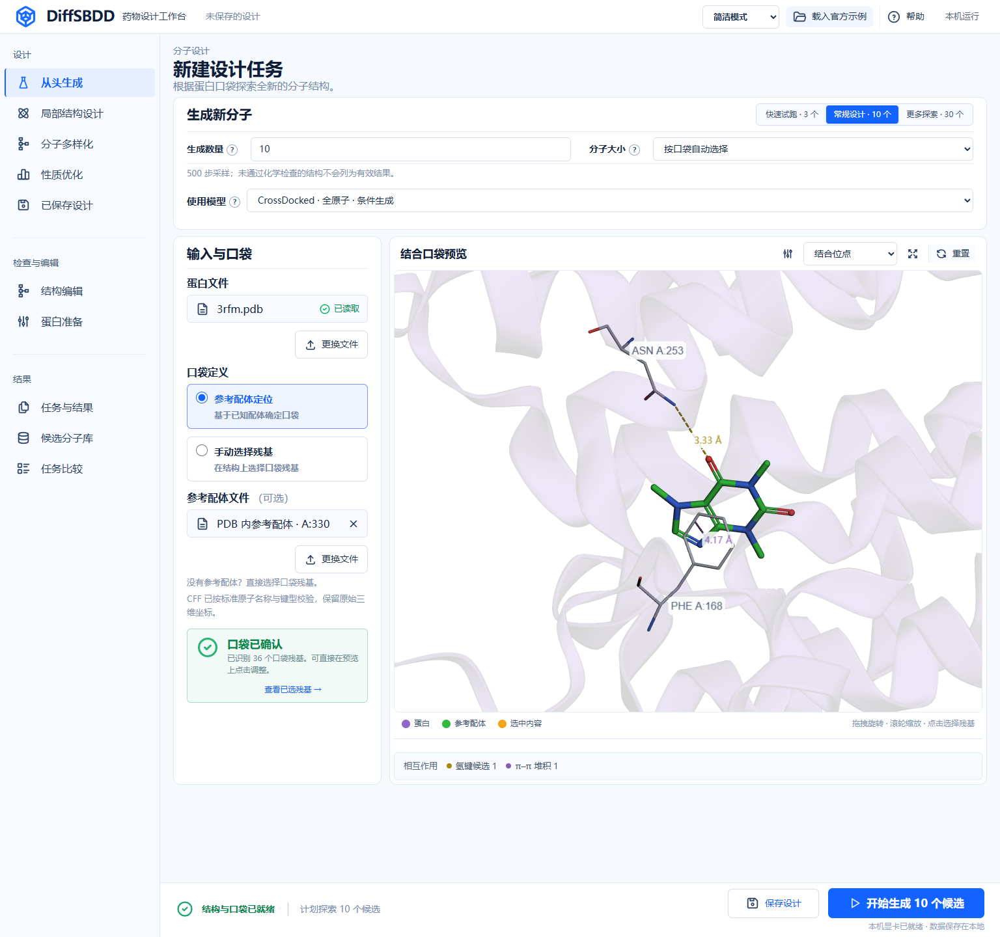

# DiffSBDD Workbench

**A local, open-source molecular-design workbench for the official DiffSBDD models.**

面向药物化学人员的本地工作台：上传蛋白与参考结构，生成口袋条件分子，在二维画布中编辑原子和化学键，检查三维姿势，并继续下一轮设计。界面为中文，完全在本机计算，不需要云端模型 API 或账户。

这是独立社区项目，与 DiffSBDD 原作者没有隶属关系。模型来自 [官方 DiffSBDD](https://github.com/arneschneuing/DiffSBDD)，论文为 [Structure-based drug design with equivariant diffusion models](https://doi.org/10.1038/s43588-024-00737-x)。本仓库的工作台代码使用 MIT；模型和第三方组件保留各自许可证，见 [THIRD_PARTY_NOTICES.md](THIRD_PARTY_NOTICES.md)。



## 能做什么

| 工作流 | 已接入的控制和结果 |
|---|---|
| 从口袋生成分子 | 8 个官方模型；按 PDB 参考配体、三维 SDF 或残基列表定义口袋；指定或按口袋估计分子大小 |
| 保留片段设计 | 三维点选整环或单原子、一键保留环骨架/外围基团；片段生长、连接、重建骨架；高级参数中可输入编号 |
| 分子多样化 | 固定起点，使用原生扰动/去噪生成结构变体；改动步数与候选数可调，不按性质择优 |
| 性质优化 | QED 或 SA；结构改动幅度、每轮候选数、优化轮数、保留数；逐轮记录与全程最佳结构 |
| 精细调整 | 采样步数、重新探索次数、联合模型的探索跨度、片段处理、UFF 自由构象松弛、可复现随机种子 |
| 论文出图 | 正交/透视投影、蛋白卡通/棍状/线框、SES/VDW/SAS 表面、邻近残基、颜色/透明度、2400–4800 像素 PNG、透明背景、视角设置导入导出 |
| 结构检查 | 二维结构、三维口袋/完整蛋白、球棍/空间填充/线框、口袋表面、原子编号、距离测量、起始结构叠加 |
| 编辑与反馈 | Ketcher 图形编辑；二维/三维双向原子选择；生成并对齐编辑后的三维起始构象；设计理由、人工评价、版本保存和继续设计 |
| 结果与实验记录 | SDF、MOL、性质 CSV、口袋 PDB、实验设置、原始候选；历史任务、取消、刷新后恢复查看 |
| 相互作用分析 | ProLIF 识别氢键候选、芳环堆积、盐桥和疏水接触；真实距离、残基定位、判定信息与 JSON 下载 |
| 生成记录 | 专家模式可保存固定片段任务的扩散中间态 JSON；仅在诊断区下载，不会替换正常分子预览 |
| 保存设计 | 将蛋白、口袋、起始结构、保留原子和参数一起保存在本机；刷新后打开继续；下载完整设计 JSON |
| 数据准备 | 选择蛋白链、去水、去氢、保留或移除非蛋白成分；下载处理后的 PDB 或直接用于设计；保持原始坐标 |
| 分子库与任务比较 | 按结构文本/任务及连通性筛选，勾选导出 SDF/CSV；比较真实任务的有效率、不重复结构、QED/SA 和耗时 |
| 模型选择 | 在设计设置中选择官方模型；只允许当前任务兼容的模型，推理前自动校验权重完整性 |

左侧直接进入四种设计任务、结构编辑、蛋白准备和结果模块；不设重复的独立预览页。三维查看、点选和相互作用分析放在实际设计与结果中。各设计页首先展示本任务的操作：从头生成的数量与大小、局部设计的起始分子与保留方式、多样化的起点与改动幅度、性质优化的目标与轮数；蛋白和口袋作为下方共享输入。任务文案、预设与字段适用范围由后端能力契约提供，四种任务使用唯一一份参数表单。

简洁模式提供常用选择，指定大小时可直接填写重原子数；专家模式平铺当前任务支持的其余参数，切换模式不改变已选参数。从历史结果选择起点会保留目标任务，选中候选即可直接继续设计，无须进入编辑器。结果页以大幅三维预览为主；结构编辑页隐藏运行报告，在宽屏下将同一份三维结构与 Ketcher 并排显示，不建立第二份分子状态。

结合位点默认采用白底、淡紫色蛋白卡通背景、完整绿色配体棍状结构、灰色关键残基和按类型着色的相互作用虚线，配合环境遮蔽阴影与主轴取景突出空间层次。相互作用简图、半透明口袋表面、完整蛋白提供直接选择；精细显示参数集中在一个出图设置窗口，输入与结果使用同一套设置，支持导入导出。选中原子使用小型标记以保持化学键可见。分子图必须通过原子、坐标、键数和键级检查后才能显示。

二维编辑器在导入时使用 Ketcher/Indigo 原生二维排布，并校验排布前后的分子及立体化学表达一致；仅重建二维画布，三维姿势保持原坐标。画布缩放按结构范围适配，切换页面只调整视口，不重新导入结构或丢失撤销记录。

PDB 参考配体按 wwPDB CCD 原子名称和键型匹配，保留原始坐标；公开示例的 CFF 定义随项目分发。其他组分可明确点击“读取标准键型”下载并缓存，或直接上传完整三维 SDF。缺少定义或重原子时不再用距离猜键。蛋白选择第一模型、每个残基占有率较高的一套替代构象，并保留二级结构标注；不会重建缺失原子。

在口袋预览中点击蛋白可选择残基；片段设计可按整环或单原子选择保留部分。结果页选择“选择保留原子”后，三维配体点选与 Ketcher 选择互相同步。二维改动化学结构后，旧原子对应关系会失效；保存编辑并生成对齐构象后恢复联动。手动测距只表示几何距离；自动相互作用由 ProLIF 的化学类型和几何规则判断。

相互作用分析采用标准氨基酸模板和隐式氢规则，显示每类/每个残基最近的一组原子，下载记录包含原子编号、距离、几何判据与检出组合数。它不包含水桥、金属配位或共价作用，也不替代质子化准备、对接、能量评价和实验验证。

### 片段约束的含义

官方 DiffSBDD 生成原子元素和三维位置，**不直接生成化学键**。工作台提供两种明确的模式：

- **仅元素与位置**：使用官方原子约束；结果的键型可能改变。
- **完整片段**：在结构重建阶段恢复输入片段内部已知键型，再检查价态和所选片段的结构及坐标。新增连接仍由生成坐标重建。芳香环需要完整选择。

两种模式都校验保留原子的空间偏移（上限 0.5 Å）。未通过约束或化学检查的候选不会列为有效结果；原始结构和失败原因仍可下载。严格片段模式可能明显降低有效率。保留的多个片段不保证最终连通，界面会显示片段数并提供连通性筛选。

## 硬件与范围

- 已在 Windows 11 + WSL2 Ubuntu、32GB 内存、RTX 5060 Laptop 8GB 上验证。
- 推理环境：Linux x86_64、Python 3.10.20、PyTorch 2.7.1 / CUDA 12.8。Windows 通过 WSL2 使用。需要兼容 CUDA 12.8 的 NVIDIA 驱动。
- 每次只计算一个分子；同一安装只允许一个推理任务。界面可查看历史记录。
- 单次最多 100 个候选；分子大小 8–80 个重原子；口袋最多 1000 个重原子；单任务一小时上限。自动大小估计限制在这一范围内。
- 条件模型支持片段设计和优化；联合模型用于新分子生成，界面会禁用不适用的组合。
- 提供的是完整的**分子设计推理工作流**。不包含模型训练、基准数据集管理、分子对接、活性预测、ADMET 或合成路线规划。
- QED/SA 改善不代表结合活性提高。近距离接触是几何指标，不是完整的碰撞能或氢键判定。编辑后的对齐构象也不是经过验证的结合姿势。
- 文字反馈和人工评分保存为设计记录，不会自动训练模型或转化为未声明的优化目标。

## 安装

以下操作在 **Ubuntu / WSL2 Ubuntu** 中执行。首次需要联网下载依赖、官方代码和约 300MB 模型权重；安装后的推理、SDF 编辑/预览与已缓存化学组分可离线使用。可选的公开组分下载仅发送组分编号，不上传蛋白、分子坐标或设计记录。CUDA/PyTorch 依赖还需要数 GB 磁盘空间。

先安装 Git、curl 和 [uv](https://docs.astral.sh/uv/getting-started/installation/)，确认 `nvidia-smi` 能看到显卡。推荐将运行环境放在 Linux 文件系统中。

```bash
git clone https://github.com/Victor-Xu-1/diffsbdd-workbench.git
cd diffsbdd-workbench
sudo install -d -o "$(id -u)" -g "$(id -g)" /opt/diffsbdd
bash install.sh
```

安装器固定官方源码提交和所有依赖版本，校验模型 SHA-256，并运行 CUDA/scatter/RDKit 环境检查。重复执行会验证已有安装；不会覆盖未知源码改动或不匹配的模型文件。

> `/opt/diffsbdd` 是本工作台专用目录。如果已有其他内容，请改用一个空目录，并先设置 `export DIFFSBDD_HOME=/absolute/path/to/runtime`。Windows 快捷脚本默认使用 `/opt/diffsbdd`。

### 启动网页

```bash
bash web.sh
```

打开 **http://127.0.0.1:7865/**。仅绑定本机回环地址。按 `Ctrl+C` 停止前台服务，正在计算的任务会取消，已有结果保留。

可选环境变量见 [.env.example](.env.example)。该文件是配置示例，不会自动加载；在启动前使用 `export` 设置。默认结果位于仓库的 `runs/`，保存的设计位于其下的 `designs/`，均被 Git 忽略。`DIFFSBDD_DATA_DIR` 可以指定外部私有数据目录，`DIFFSBDD_PORT` 可指定端口。备份时请保留整个数据目录。

### Windows 的后台服务和快捷启动

将仓库克隆到 Windows 可访问的目录，并完成 Ubuntu 安装后，在该目录的 PowerShell 中执行：

```powershell
powershell -NoProfile -ExecutionPolicy Bypass -File .\install-web.ps1
.\web.cmd start
.\web.cmd status
.\web.cmd stop
```

后台服务由 WSL2 Ubuntu 的 systemd 管理，启用后会随该发行版启动。Windows 登录本身不会自动启动 WSL；需要时运行 `web.cmd start`。此脚本只管理 `diffsbdd-local.service`，不会关闭 WSL 或其他服务。

## 如何使用

1. 页面从空白输入开始。上传自己的蛋白 PDB，或主动点击“载入官方示例”。读取成功后才显示文件和口袋状态。文件里的小分子可用于定位口袋；没有参考配体时直接在预览上点选残基。外部参考配体的 SDF 必须已与蛋白对齐。需要选链或去水时，点击左侧“蛋白准备”，无需再上传一份文件。
2. 选择任务，再选“快速试跑 / 常规设计 / 更多探索”。默认全原子 CrossDocked 条件模型。常规从头生成尝试 10 个候选、500 步；快速试跑为 3 个、100 步，用于检查流程，可能降低结构质量。优化任务的预设会同时设置轮数、每轮数量和改动幅度。参数旁的 **?** 支持鼠标悬停、键盘聚焦和点击说明。顶部切换“专家模式”即可展开当前任务实际使用的精细参数；不适用的字段不会提交。
3. 查看结果卡片和三维姿势。检查分子是否连通、是否存在不合理近距离接触，再参考 QED、SA、分子量、logP、极性表面积等。
4. 在编辑器中修改原子或键，填写设计理由并保存。“下一轮想做什么”提供局部结构设计、多样化、性质优化三个实际任务；可用原分子继续，或保存编辑版后继续，进入设计页后使用该任务的预设。
5. 保留片段设计可使用已有结果，或上传起始片段 SDF。在预览工具栏选择“选配体片段”，直接点选整环或单原子；橙色标记表示保留部分。也可一键保留环骨架或外围基团。稠合环会一起选择；精细调整请切换单原子。高级参数中的原子编号从 1 开始。
6. 点击“保存设计”保留完整输入，下次从“已保存设计”打开。下载结果可在任务页完成，也可在分子库勾选多个候选批量导出。展开任务详情可查看实际使用的设置、未保留原因及原始候选。

数据准备仅做结构筛选，不会补全缺失原子或分配质子化状态。任务比较汇总已有计算结果，不代表论文基准评测。保存设计需要有效的蛋白、口袋及任务所需的起始结构；旧版本仅存参数的浏览器草稿不会自动转换为完整设计。

## 结构显示与出图

页面使用参考图的浅色、蓝白配色与卡片风格，结构按实际工作流精简；预览来自真实结构，示例残基数由解析器计算。两个三维面板均有“显示与出图”：

- 主链卡通、完整残基棍状、线框；配体球棍、棍状、空间填充和线框。氮蓝、氧红、硫黄，碳色可调。
- SES 为溶剂排除表面；VDW 为范德华表面；SAS 为溶剂可及表面。表面颜色用于区分结构区域，不表示计算得到的静电势。
- 邻近范围默认 4.5 Å，可在 3–8 Å 内调整；优先显示实际检出相互作用的残基，也可展开全部近邻。标签带链与残基编号，最多显示 8 个关键残基；尚无相互作用时显示最多 6 个近邻。密集标注请手动旋转或关闭，检查无遮挡后导出。
- 高清 PNG 直接在指定分辨率重新渲染 WebGL；不是放大小截图。可选透明背景。视图设置 JSON 与原始 PDB/SDF 配套使用，导入不会改变结构坐标。
- JMC / Nature 并无一个统一的“期刊配色”。工作台提供常见科研图规范和精细显示控制；最终版式、字号、分辨率与物理尺寸请按具体投稿要求检查。

## CLI 与本地 API

网页和命令行共用同一个工作进程，不是两套模型实现。

```bash
/opt/diffsbdd/venv/bin/python -m local_diffsbdd doctor
/opt/diffsbdd/venv/bin/python -m local_diffsbdd demo --count 3 --atoms 24
/opt/diffsbdd/venv/bin/python -m local_diffsbdd generate \
  --protein examples/3rfm.pdb --reference A:330 \
  --settings examples/generate.json --output runs/cli
```

片段设计使用 `inpaint --protein ... --reference ... --initial-ligand aligned.sdf --settings design.json`；性质优化使用 `optimize`；不按性质筛选的变体探索使用 `diversify`。配置格式由 `local_diffsbdd/options.py` 唯一定义，网页可下载可复用的设置文件。CLI 任务类型必须与 JSON 中的 `task` 一致。**JSON 中保留原子编号从 0 开始**，这是 API 契约，界面会自动转换。

Windows 同样可以使用：

```powershell
.\diffsbdd.cmd doctor
.\diffsbdd.cmd demo -Count 3 -Atoms 24
.\diffsbdd.cmd generate -Protein .\examples\3rfm.pdb -Reference A:330 -Settings .\examples\generate.json
```

API 入口：`GET /api/health`、`GET/POST /api/jobs`、`GET /api/jobs/{id}`、`POST /api/jobs/{id}/cancel`、`POST /api/jobs/{id}/edits`、`POST /api/poses/inspect`、`POST /api/pockets/inspect`。保存设计使用 `GET/POST /api/designs`、`GET/PUT /api/designs/{id}` 和 `GET /api/designs/{id}/export`；更新需提供当前 `revision`，过期更新返回 409。附加工具入口为 `POST /api/structures/prepare`、`POST /api/library/export`、`POST /api/jobs/compare`、`POST /api/models/{id}/verify`、`POST /api/interactions/inspect`、`POST /api/components/{id}/download`。写请求需 JSON 和 `X-DiffSBDD-Client: local-ui`；浏览器请求还需匹配本机 Origin。不要把本服务直接开放到局域网或公网，它没有多人认证系统。

## 测试与开发

```bash
# 已安装完整运行环境时
/opt/diffsbdd/venv/bin/python -m unittest discover -s tests -v
uvx --from ruff==0.15.7 ruff check local_diffsbdd tests tools
uvx --from ruff==0.15.7 ruff format --check local_diffsbdd tests tools
bash -n install.sh web.sh

# 前端只需 Node.js 22+；日常运行不需要 Node.js
npm ci
npm test
npx prettier --check 'web/*.js' 'web/**/*.css' 'web/*.html' 'tests/*.mjs'

# 对正在运行的真实 GPU 服务进行浏览器端到端测试
npx playwright install chromium
npm run test:e2e
# 或使用本机 Chrome：PLAYWRIGHT_CHANNEL=chrome npm run test:e2e

# 不启动 GPU 推理的真实页面测试（两个终端）
# 终端一，使用安装好的 Python 环境：
/opt/diffsbdd/venv/bin/python -m tests.serve_fixture
# 终端二：
DIFFSBDD_TEST_URL=http://127.0.0.1:17865 npm run test:e2e -- --ui-only
DIFFSBDD_TEST_URL=http://127.0.0.1:17865 node tests/pages.mjs
DIFFSBDD_TEST_URL=http://127.0.0.1:17865 node tests/layout.mjs
DIFFSBDD_TEST_URL=http://127.0.0.1:17865 node tests/molecular.mjs
DIFFSBDD_TEST_URL=http://127.0.0.1:17865 node tests/workspace_modes.mjs
```

完整 GPU 浏览器测试会真实生成分子、编辑结构、运行优化、下载结果与诊断轨迹，并取消一个任务。测试数据保存在被忽略的 `runs/` 和 `test-results/`；请等待其他计算任务结束后运行。

CPU CI 的 `--ui-only` 模式使用明确标注的真实历史生成样例，仅验证界面、HTTP、化学解析与编辑，不作为 GPU 推理成功的证据。真实 GPU 测试及已知限制见 [docs/VALIDATION.md](docs/VALIDATION.md)。

无需前端构建：HTML/CSS/ES modules 直接由 FastAPI 提供，3Dmol.js 和 Ketcher 资源固定版本并随仓库分发。依赖更新后必须重新生成锁文件，并重新进行 GPU 和浏览器验证。

## 架构与维护边界

| 层 | 职责 |
|---|---|
| `web/app.js` / `shell.js` / `controls.js` | 任务状态、页面组合及药化参数表单 |
| `capabilities.py` / `web/contract.js` | 唯一模型能力与预设目录；参数范围、默认值与枚举来自 `DesignOptions`，浏览器按契约展示和筛选提交字段 |
| `web/help.js` | 可访问的药化术语说明，不参与推理参数定义 |
| `web/designs-ui.js` / `preparation-ui.js` / `collections-ui.js` | 保存设计、PDB 准备、分子库和任务比较，各自通过 API 操作真实数据 |
| `web/pocket-ui.js` / `pocket-viewer.js` / `preview.js` | 口袋选择、输入预览与候选结构交互 |
| `web/molecular-style.js` / `figure-panel.js` | 两个视图共用的科学显示规范、视角与高清出图 |
| `web/molecular-model.js` / `molecular-camera.js` / `molecular-viewport.js` | 渲染边界的化学图完整性、仅改变视角的取景、尺寸变化后的自动取景 |
| `web/experience.js` | 简洁/专家模式，不另建一套参数或分子状态 |
| `components.py` / `interactions.py` / `web/interactions.js` | 可信来源的化学组分定义、ProLIF 判定、共享相互作用呈现与下载 |
| `web/molecular-selection.js` / `editor-bridge.js` | 共享环/原子选择与身份校验；唯一 Ketcher 适配边界，异步 Molfile 导入导出及选择事件联动 |
| `web/styles/` | 基础、布局、设计页、结果页与响应式样式 |
| `contracts.py` / `options.py` | HTTP 输入及模型任务的统一配置契约 |
| `web.py` / `jobs.py` | 本机安全边界、持久化任务、单任务调度、子进程取消 |
| `workspace_api.py` / `designs.py` / `preparation.py` / `collections.py` | 薄路由、设计快照与版本冲突、PDB 筛选、真实结果导出/比较；复用统一输入和结果契约 |
| `generation.py` / `sampling.py` / `optimization.py` | 逐分子推理、官方模型适配、片段约束和多轮选择 |
| `inputs.py` / `pockets.py` / `editing.py` / `results.py` | 真实结构校验、编辑后的构象生成/对齐、化学性质和结果保存 |
| `runtime.py` / `registry.py` | 固定模型与源码的加载及来源校验 |

数据路径：浏览器 → 有类型的 API 输入 → 单一 CLI 工作进程 → 官方 DiffSBDD → RDKit 检查/性质计算 → 原子写入的记录 → 界面和下载。没有数据库或 LLM 服务。口袋预览与提交计算共用 `pockets.prepare_input`，避免前端看到的残基与模型实际使用的口袋不一致。

`GET /api/capabilities` 提供模型、可用任务、参数范围/枚举、适用条件与预设。前端不按模型名称拼接 ID，也不另写一套采样参数范围或预设数值。布局、图形样式和说明文字仍属于正常的界面代码。旧任务的完整原始设置保留在下载记录中；页面仅展示当时任务实际相关的选项。模型检查的维护 API 保留，前端的重复手动检查按钮已移除。

官方源码始终位于运行环境中，不复制进本仓库。`patches/upstream.patch` 只修复优化时的 CPU/GPU 掩码以及新版 BioPython 的残基映射导入。运行时校验整个源码 diff；模型结构和权重不修改。旧 Cα 权重中已废弃的 `noise_factor=1.0` 配置按官方 Lightning 加载器的兼容语义移除，其他未知配置不会静默忽略。

## 故障排查与恢复

- **页面打不开**：检查 `web.cmd status` 或前台启动输出；确认端口未被占用。代理可能干扰 localhost，可尝试 `127.0.0.1` 并绕过本机地址代理。
- **显卡不可用**：先检查 Windows/Ubuntu 的 `nvidia-smi`，再执行 `doctor`。不要把 RTX 50 系列环境换回官方早期的 CUDA 11.x 依赖。
- **没有有效分子**：这不一定是程序故障。查看未保留原因，尝试其他复现实验编号、分子大小或模型。完整片段约束可能因键型、价态或几何要求而拒绝结果。
- **编辑无法对齐**：编辑后的分子必须与原结构保有足够共同骨架。大幅改骨架请使用固定片段设计，并检查三维起点。
- **下载中断或哈希错误**：不要跳过校验。将不匹配的模型文件移出专用模型目录后重新运行安装器；它会覆盖自身的 `.part` 下载文件。
- **中断的任务**：取消或重启不会删除已完成分子。旧任务会标记为中断；复用设置可以新建任务，不支持从扩散中间步恢复。
- **回滚**：停止工作台服务，切换到此前已验证的仓库提交并运行对应 `install.sh`，再启动。先备份 `runs/` 或自定义数据目录。安装器检测到不同源码补丁时会拒绝覆盖，应在新的专用 `DIFFSBDD_HOME` 目录重新安装该版本；不使用强制重置覆盖既有环境。

安全范围与依赖审计说明见 [SECURITY.md](SECURITY.md)。请勿提交私有蛋白、设计记录、模型权重、密钥或本机环境文件。
